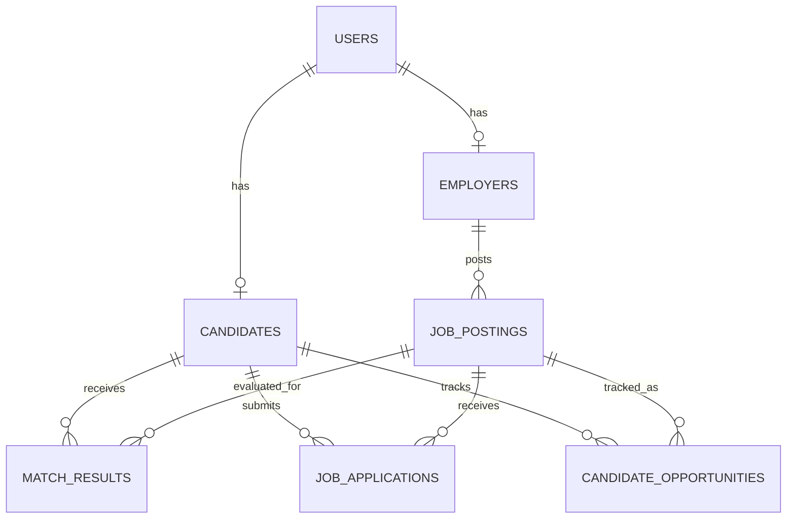
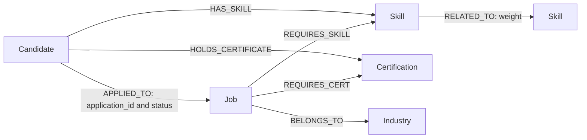

# Database Design and Operation

Implemented and applied locally on 2026-10-02: Alembic revision
`20261002_0005`. PostgreSQL is the authoritative store; Neo4j is a rebuildable
skill/application graph. pgAdmin 4 is the PostgreSQL administration interface,
not a separate database. No cloud database or native PostgreSQL installation was
modified. Existing Docker volumes and records were preserved.

## Relational Schema

The original five core tables remain. Three supporting tables cover candidate
activity, application workflow and reliable graph synchronization. There are
eight application tables, plus Alembic's internal version table.

| Table | Purpose and constraints |
| --- | --- |
| `users` | UUID PK, unique email, password hash, role enum, creation timestamp |
| `candidates` | UUID PK, unique user FK; name, contact/location, experience, salary expectation, skills/certifications, parsed text and embedding storage; nullable `work_authorized` means unknown |
| `employers` | UUID PK, unique user FK; company, industry, location |
| `job_postings` | UUID PK, employer FK; title/description, experience, location, salary minimum/maximum, skills/certifications, authorization requirement, open/closed status and posting timestamp |
| `match_results` | UUID PK, candidate/job FKs; rule outcome, component/final scores, JSON explanation, model version and computation timestamp; generated `matching_status` is eligible/filtered, not application status |
| `candidate_opportunities` | Unique candidate/job pair; saved/viewed/applied activity for the existing frontend; automatically updated timestamp |
| `job_applications` | Unique candidate/job pair; submitted/reviewing/shortlisted/rejected/hired/withdrawn status; created/updated timestamps |
| `graph_sync_events` | Transactional outbox: entity type, entity UUID, event UUID, timestamp; deliberately no entity FK so deletion events survive |

Foreign keys cascade deletion of dependent relational data. Positive-experience,
nonnegative salary, ordered salary bounds, final-score range, application-status
and outbox-type checks reject invalid writes. Foreign-key/query indexes support
employer job lists, open jobs, candidate match history, job ranking and applications.
Unknown salaries remain nullable; they are not converted to zero.

Compatibility with the supplied ER names:

| Proposed name | Existing implementation retained |
| --- | --- |
| `experience_years` | `candidates.years_experience` |
| `salary_expectation` | `candidates.expected_salary` |
| `salary_range` | `salary_range_min` and `salary_range_max`, Numeric(12,2) |
| `match_score` | `match_results.final_weighted_score` |
| `computed_at` | `match_results.created_at` |

These names avoid breaking the current frontend, seed data and previous migrations.
Amounts follow the current Kenyan-shilling use case; cross-currency/period matching
is not implemented. Work authorization is a declared boolean, not document verification
or a multi-country permit system. Role-to-profile permissions are enforced by the API;
unique user FKs alone do not prevent a privileged SQL operator creating both profiles.



Candidate profiles use composition with User, not SQL inheritance. Scoring receives
loaded records; ML should not own authentication or independently write either DB.

## Neo4j Domain



Candidate and Job nodes use the PostgreSQL UUID as `id`, with uniqueness constraints.
Skill, Certification and Industry names also have uniqueness constraints. Jobs with
the same title remain distinct. No names, emails, raw CVs or credentials are copied
onto Candidate nodes by the new projector. Application status, including rejection
or withdrawal, describes historical `APPLIED_TO` edges rather than deleting history.

Existing `JobRole` ontology nodes and `SKILL_REQUIRED` edges remain taxonomy data;
they are not individual postings. Legacy title-based projections are not deleted
automatically. New writes reuse an existing case-insensitive skill name when present;
new labels are stripped/casefolded. Existing duplicate aliases are not destructively
merged. Curated ontology provenance/official CDACC validation remain separate work.

## Synchronization

PostgreSQL triggers enqueue candidate, job and application inserts/updates/deletes
in the same transaction as the data write. Employer industry changes queue its jobs.
Rollback removes both the data write and its events. The migration backfills events
for current records and converts existing `applied` activity into applications.

The worker reads current authoritative data, replaces relevant edges in one Neo4j
transaction, then acknowledges the event in PostgreSQL. Graph failures roll back the
acknowledgement and leave events queued. Replays are idempotent; crashes after a graph
commit can cause a harmless replay. A PostgreSQL advisory lock serializes workers.
Only graph entities referenced by events are removed, not the whole ontology.

Run from `backend/` after migrations, or schedule periodically:

```powershell
..\venv\Scripts\python.exe -m app.db.graph_sync --limit 1000
```

This command exits after one batch. **No automatic background worker is installed.**
Schedule it before expecting ongoing graph freshness; API writes succeed while graph
work is queued. The seed loader drains up to 10,000 queued events after committing
unless `--skip-graph` is used; that flag delays projection, not trigger enqueueing.
Monitor `SELECT count(*) FROM graph_sync_events;`. Failures retain events, so repair
connectivity/data and rerun. A persistently failing oldest event blocks later work;
dead-letter queues, retention policies and production worker supervision remain open.

## API Contracts

Existing `/api` routes are retained rather than silently moving to `/api/v1`.

| Operation | Route | Access |
| --- | --- | --- |
| Register/login | `POST /api/auth/register`, `/api/auth/login` | Public candidate/recruiter signup; no public admin signup |
| Read/update profile | `GET/PUT /api/candidates/me` | Candidate's own profile |
| Parse CV | `POST /api/candidates/upload-resume` | Candidate; commits parsed fields, graph event queued |
| Recommendations | `GET /api/candidates/dashboard` | Candidate; For You excludes failed hard rules |
| Open jobs | `GET /api/jobs/` | Public |
| Create/edit/close job | `POST /api/jobs/create`, `PUT /api/jobs/{job_id}` | Recruiter owner or admin; PUT is full replacement, status can be closed |
| Apply | `POST /api/candidates/opportunities/{job_id}` with `status: applied` | Candidate; open job and hard-rule pass required; retries do not duplicate/reset application |
| Candidate applications | `GET /api/candidates/me/applications` | Own records, latest 100 |
| Recruiter pipeline | `GET /api/jobs/{job_id}/applications` | Job owner/admin, latest 100 |
| Change application status | `PATCH /api/jobs/{job_id}/applications/{application_id}` | Job owner/admin |
| Compute/persist rankings | `POST /api/matches/evaluate/{job_id}` | Job owner/admin; now appends immutable result snapshots and returns match IDs |
| Stored explanation | `GET /api/matches/{match_id}` | Candidate owner, job owner, or admin |
| Health/admin summary | Existing health/admin routes | Health public, summary admin-only |

Application transitions: submitted -> reviewing/shortlisted/rejected;
reviewing -> shortlisted/rejected; shortlisted -> hired/rejected. Repeating the
current status is allowed. Terminal states cannot be reopened through this API.
The database also reserves withdrawn; candidate withdrawal UI/API is not yet added.
Saving/viewing does not erase a recruiter-managed application. Old activity status
is not a substitute for the new application-status table.

The rule gate checks work authorization before graph/ML scoring. A required permit
with unknown/false candidate authorization fails. Existing experience, location,
salary and certification rules remain. Scoring formulas/weights were not retrained
or changed; graph-to-ML feature parity remains unresolved. Stored `model_version`
explicitly identifies the legacy, unverified serving implementation. Historical
rows have unknown provenance. Do not present scores as validated hiring confidence.

The requested broader admin-management/ontology UI, advanced search, model service
refactor and new frontend application-status controls are not completed by this
database increment. New API schemas/routes are available for that subsequent work.

## Inspect the Databases

- pgAdmin web: `http://127.0.0.1:5050`.
- In **Docker pgAdmin**, register PostgreSQL host `postgres`, port `5432`, database
  `workforce`, user from the project's local environment. Enter its password directly.
- In **desktop pgAdmin**, use host `127.0.0.1`, port `5433`, same database/user.
- Expand Servers -> Databases -> workforce -> Schemas -> public -> Tables and refresh.
- Neo4j Browser: `http://127.0.0.1:7474`, Bolt `bolt://127.0.0.1:7687`.

```sql
SELECT version_num FROM alembic_version;
SELECT tablename FROM pg_tables WHERE schemaname = 'public' ORDER BY tablename;
SELECT count(*) AS pending_events FROM graph_sync_events;
```

```cypher
SHOW CONSTRAINTS;
MATCH (candidate:Candidate)-[edge:HAS_SKILL]->(skill:Skill)
RETURN candidate, edge, skill LIMIT 50;
MATCH (job:Job)-[edge:REQUIRES_SKILL|BELONGS_TO]->(target)
RETURN job, edge, target LIMIT 50;
MATCH (candidate:Candidate)-[edge:APPLIED_TO]->(job:Job)
RETURN candidate, edge, job LIMIT 50;
```

No applications existed in the project backfill, so APPLIED_TO can legitimately be
empty until an application is submitted. The database is not populated with invented
applications merely to make the graph look complete.

## Validation and Recovery

Before migration: 36 users, 29 candidates, 24 jobs at revision `0004`.
After migration: the same counts at `0005`; 53 initial graph events processed,
zero pending. Backup archive was checked and copied to
`%LOCALAPPDATA%\jobbridge-before-0005-20261002.dump`, outside Git. Do not use
downgrade as routine rollback after new applications exist: it drops new tables.
Review/restore a backup into a separate database first if recovery is needed.

```powershell
$env:RUN_DATABASE_MIGRATION_TESTS = '1'
try {
    .\venv\Scripts\python.exe -m pytest backend/tests -q
} finally {
    Remove-Item Env:RUN_DATABASE_MIGRATION_TESTS
}
```

Tests use temporary PostgreSQL databases and unique graph test IDs, then clean up
only those resources. Tests require local database-create privileges and Neo4j.
Coverage includes upgrade/downgrade, ORM parity, unique/range checks, transaction
rollback, graph updates/deletes, duplicate-title jobs and real JWT/API persistence.
ML is stubbed in the workflow test; this is not model-quality or browser evidence.

Final local run: **50 tests passed** with dependency deprecation warnings. Graph
verification found 29 Candidate nodes, 24 Job nodes, 72 REQUIRES_SKILL edges and
21 BELONGS_TO edges; absent employer industries are not invented. The editor also
reported an unresolved pytest import in one test file despite successful execution
in the explicit project venv; editor interpreter configuration was not changed.